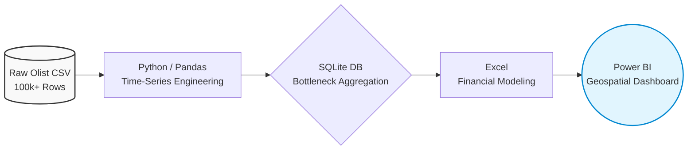

# 📦 E-Commerce Supply Chain & Delivery Optimization

## 📌 Executive Summary
Late deliveries severely impact customer satisfaction and increase operational costs through shipping refunds. This project analyzes a real-world e-commerce dataset (Olist) of over 100,000 orders to identify geographical supply chain bottlenecks and calculate the financial impact of delayed shipments. 

By engineering the raw shipping logs, I isolated the late deliveries and built a financial model demonstrating exactly which regions are costing the company the most in potential refund liabilities.

### ⚙️ Data Architecture & Pipeline

# E-Commerce Supply Chain & Delivery Optimization

## Overview:-

Late deliveries are one of the fastest ways an e-commerce company looses money and trust: they trigger refund requests, drive up support tickets, and quietly erode repeat purchase rates. In this project dig into that problem using the list dataset, a real-world collection of 100,000+ Brazilian e-commerce orders, to find out exactly where deliveries are breaking down and the heavy cost to the business.

here my goal wasn't just to say "some orders are late." It was to answer questions a logistics team could actually act on: Which states are driving the problem? How much freight revenue is at risk if customers start claiming refunds? And are certain product categories making things worse?

## What I Did:-

**Cleaned and engineered the data (Python / Pandas)**:- Started with several relational CSV files from list's order and logistics tables, joined them, converted raw timestamps into useable dates, and calculated the delay between estimated and actual delivery for every order. This is what let me find late shipments from the rest of the dataset and treat delay as a measurable variable rather than a yes/no flag.

**Aggregated and queried the results (SQL)**:- Loaded the cleaned dataset into SQLite and wrote queries to rank states by total late orders and average days late, surfacing the top 10 worst-performing regions.

**Built a financial model (Excel)**:- Translated the delay data into dollar terms: total freight revenue tied up in late orders, and an estimated monthly refund exposure under a 50% return assumption. This turns "late deliveries" into a number a finance or logistics leader can actually put in front of a decision-maker.

**Designed an executive dashboard (Power BI)**:- Built an interactive, geospatial dashboard so a logistics manager can filter by state and product category and see bottlenecks at a glance, rather than digging through spreadsheets.

## Key Findings:-

1. Sao Paulo (SP) is the single biggest problem causing state. It has the highest volume of late deliveries of any state, making it the clearest candidate for immediate logistics intervention.
2. The financial exposure is concentrated, not spread thin. The 10 worst-performing states account for a big share of total revenue at risk, meaning a handful of targeted fixes could meaningfully reduce refund liability.
3. Heavier and bulkier product categories are consistently more delay-prone than lightweight consumer goods, suggesting the bottleneck sits at least partly in handling and transport logistics rather than order processing.

## Recommendations:-

1. Renegotiate regional carrier contracts. Start with the providers operating in the highest-delay states, especially SP and RJ, and push for tighter rules with real accountability.
2. Make delivery estimates smarter. Pad the checkout algorithm's estimated delivery window by 2–3 days for regions with a track record of delays. It's a small change that manages customer expectations and can meaningfully reduce refund claims.

## Tools Used:-

Python (Pandas) · SQL (SQLite) · Excel · Power BI
